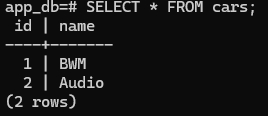

Собирается путем выполнения команд:
```
kubectl apply -f postgres.yaml
kubectl apply -f app.yaml
```
Для проверки работоспособности подов:
```
kubectl get pods
```
Для проверки БД:
* подключаемся к БД поду
```
kubectl exec --stdin --tty <Название postgres пода> -- /bin/bash
```
* подключаемся к БД приложения
```
psql -h localhost -U postgres -d app_db
```
* далее можно выполнить любой SQL запрос на проверку данных

